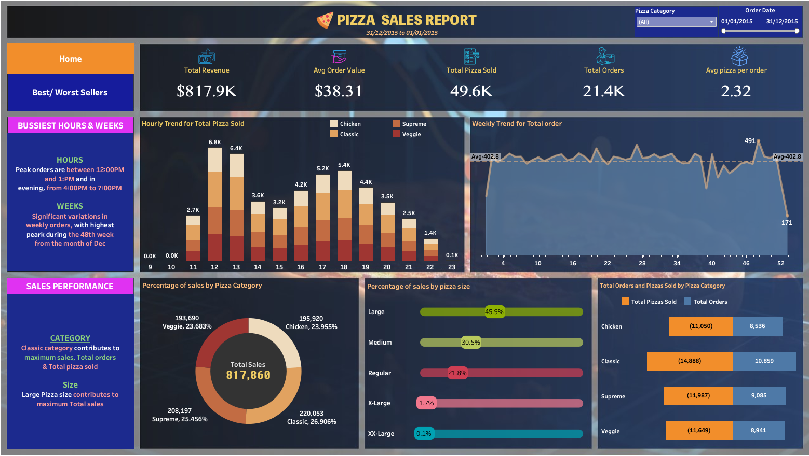
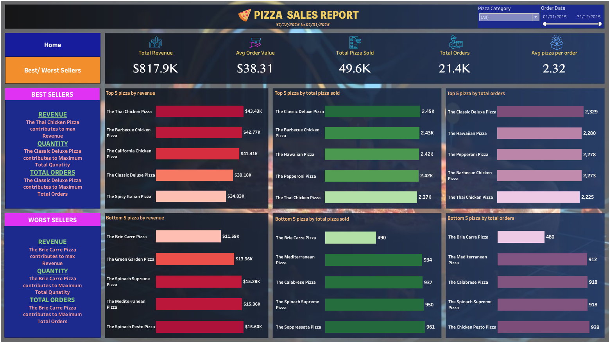

# Pizza Sales Analysis (PostgreSQL + Tableau)

## Overview

This project analyzes pizza sales data to understand business performance, customer behavior and product trends.
Data was processed using PostgreSQL and visualized using Tableau dashboards.

---

## Tools Used

* PostgreSQL
* Tableau
* SQL

---

## Key Metrics

* Total Revenue: $817.9K
* Total Orders: 21.4K
* Total Pizzas Sold: 49.6K
* Average Order Value: $38.31
* Average Pizzas per Order: 2.32

---

## Dashboard 1: Sales Overview

Key insights:

* Peak orders between 12 PM – 1 PM and 4 PM – 7 PM
* Higher sales towards end of the year
* Classic category contributes most to revenue
* Large size pizzas generate highest sales

---

## Dashboard 2: Best & Worst Sellers

Key insights:

* Thai Chicken Pizza generates highest revenue
* Classic Deluxe Pizza leads in quantity and orders
* Brie Carre Pizza is the lowest performing

---

## What I Did

* Cleaned and structured data using PostgreSQL
* Wrote SQL queries for KPI and trend analysis
* Built interactive dashboards in Tableau

---

## Project Structure

* pizza_sales.csv → dataset
* analysis_queries.sql → SQL queries
* .twbx file → Tableau dashboard
* images/ → dashboard screenshots

---

## Conclusion

This project demonstrates end-to-end data analysis from raw data to insights using SQL and Tableau.
